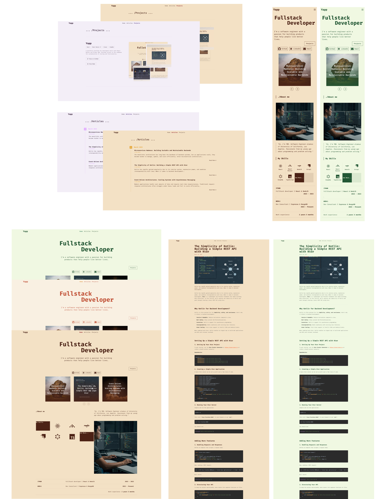

# Yapp (Yet Another Project Portfolio)

A portfolio platform for developers built with React Router and Strapi CMS. Provides access to the codebase for customization of styling and functionality.



*Screenshot of Yapp portfolio application showing the customizable theme colors*


## About

Yapp is a portfolio application, started it to explore the use of React Router and Strapi CMS, feel free to use it modify or contribute to it.

## Tech Stack

- **Frontend**: 
  - React Router v7
  - TypeScript
  - TailwindCSS
  - Server-Side Rendering

- **Backend**: 
  - Strapi v5 headless CMS
  - GraphQL API

- **Developer Tools**: 
  - Yarn workspaces (v4.4.1)
  - Docker
  - TypeScript v4
  - Prettier

## Project Structure

```
yapo/
├── apps/
│   ├── web/    # React Router frontend
│   └── cms/    # Strapi CMS backend
```

## Getting Started

### Prerequisites
- Node.js v22+

### Setup (Local Development)

```bash
# Install dependencies
yarn install

# Generate Strapi API token for the web app
yarn setup

# Start frontend (http://localhost:5173)
cd apps/web && yarn dev

# Start CMS (http://localhost:1337)
cd apps/cms && yarn develop
```

### Docker Setup

The project includes Docker configurations for both the CMS and web applications:

- `Dockerfile.cms` - Strapi CMS container
  - Automatically generates secure random values for all required environment variables
  - Creates a .env file with database configuration and security tokens
  - No manual configuration required

- `Dockerfile.web` - React Router frontend container
  - Expects environment variables to be provided when running the container
  - Required variables can be found in `apps/web/.env.example`

To build and run the Docker containers:

```bash
# Build the CMS image
docker build -t yapp-cms -f Dockerfile.cms .

# Build the web image
docker build -t yapp-web -f Dockerfile.web .

# Run the CMS container
docker run -d -p 1337:1337 --name yapp-cms yapp-cms

# Run the web container with environment variables
docker run -d -p 3000:3000 --name yapp-web \
  -e VITE_STRAPI_URL=http://yapp-cms:1337 \
  -e VITE_STRAPI_TOKEN="your_strapi_token" \
  -e VITE_NODE_ENV=production \
  -e VITE_THEME=red-wine \
  yapp-web
```

Then access:
- Frontend: http://localhost:3000
- CMS: http://localhost:1337

### Environment Variables

The project uses environment variables for configuration:

- **CMS (.env)**: 
  - Generated automatically by `setup-cms-env.js` script during Docker build
  - Contains secure random values for Strapi security keys and database configuration
  - No manual configuration needed for Docker deployment

- **Web (.env)**:
  - Required variables are listed in `apps/web/.env.example`
  - For local development: Copy `apps/web/.env.example` to `apps/web/.env` and fill in values
  - For Docker: Environment variables should be provided in the `docker-compose.yml` file or at runtime
  - Required variables include:
    - `VITE_STRAPI_TOKEN`: API token for Strapi CMS access
    - `VITE_STRAPI_URL`: URL to the Strapi CMS instance
    - `VITE_NODE_ENV`: Environment mode (development/production)
    - `VITE_THEME`: Theme selection (see Customization section)

## Customization

### Theme System

The application includes a server-side rendered theme system with 5 pre-configured themes:

1. **Red Wine** (`VITE_THEME=red-wine`): Burgundy and gold tones
2. **Forest Glade** (`VITE_THEME=forest-glade`): Green and nature-inspired
3. **Desert Bloom** (`VITE_THEME=desert-bloom`): Terracotta and sand
4. **Midnight Plum** (`VITE_THEME=midnight-plum`): Deep purple with lavender
5. **Spice Market** (`VITE_THEME=spice-market`): Vibrant orange with teal

To change the theme, update the `VITE_THEME` variable in your `.env` file:

```bash
# apps/web/.env
VITE_THEME=forest-glade
```

Themes are applied server-side to prevent flash of unstyled content during page load.

### Custom Code Changes

- Modify whatever you want in the codebase.
- Theme colors are now controlled via environment variables, see `apps/web/app/utils/theme.ts` for the theme definitions.

## License

GLWTPL License - see [LICENSE](LICENSE) file for details.

## Contributing

Contributions accepted via Pull Requests.